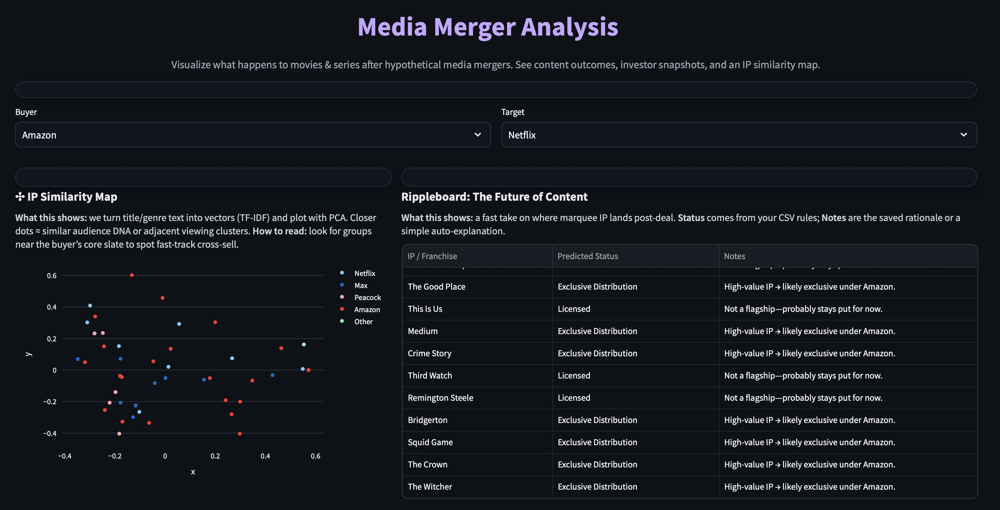
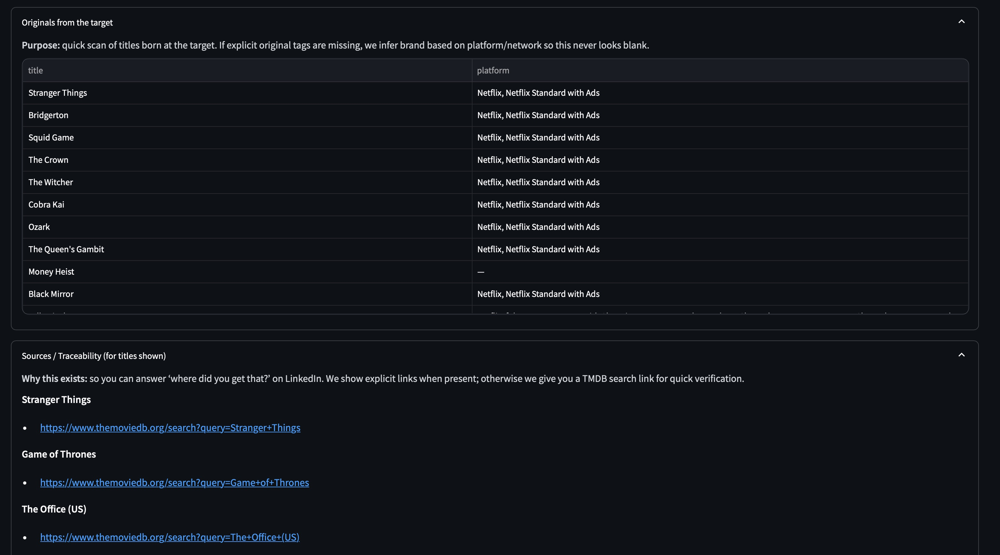

Who streams what after the deal.
A hobby project that simulates where marquee IP (shows/films) would likely land if one media company bought another—with receipts (traceable sources) and a light vibe-check from headlines.

Live app: (https://streamshift-aiaptrnvxydq4ka23avbsz.streamlit.app/)

Why this exists:

Google tells you where to watch now. This app asks: “where would it land after a merger—and why?” It’s a tiny strategy sandbox:

Scenario selectors: Buyer × Target → live, portfolio-level view

Rippleboard: plain-English status per title (stay / licensed / exclusive) + human notes

IP Similarity Map: visual “adjacency” clusters for cross-sell potential

Originals from the target: first-party titles a brand will fight to keep home

Traceability: every claim links to official pages (or a TMDB search if we don’t have a link)

Headlines mood: quick sentiment pulse across the brands you picked

Screens

Hero – choose Buyer / Target, read a crisp intro

Rippleboard – title-level outcomes with notes

IP Similarity Map – embeddings → 2D projection → color clusters

Originals – the target’s first-party slate

Sources / Traceability – receipts for what’s on screen

Headline Mood – “vibes, not valuation” bar + clickable links

Tech stack (fun parts)

Streamlit · Pandas · Plotly · FAISS Vector Search · Sentence-Transformers Embeddings · Zero-Shot Labeling · Knowledge Graph · Declarative Rule Engine · Tiny LLM Explanations

Embeddings + FAISS — title + tags → all-MiniLM-L6-v2 embeddings → FAISS index → UMAP/PCA projection for the map

Heuristics + Rule Engine — simple, explainable rules produce status labels and one-liners

Traceability — explicit source_urls per title; if missing, we surface a TMDB search link to verify

Headline Mood — tiny VADER sentiment on per-brand headlines for a fast “market tone” check

Agentic feel — tiny pipeline that nudges messy rights chatter into transparent, auditable outputs

Design & product copy were iterated with ChatGPT (GPT-5 Thinking) and Google AI Studio (for rapid UI text and layout sketches). Human judgment.

Data model:

brand,headline,link,date
Amazon,"Prime Video and NBA announce landmark 11-year global media-rights deal","https://advertising.amazon.com/blog/prime-video-nba-2025-deal",2024-07-25
Warner Brothers HBO,"WBD: Max will become HBO Max this summer (official)","https://press.wbd.com/us/media-release/warner-bros-discovery-announces-max-become-hbo-max-summer",2025-05-14
Netflix,"Netflix and Universal expand U.S. licensing deal — live-action films from 2027 (official)","https://about.netflix.com/news/netflix-and-universal-filmed-entertainment-group-expand-us-licensing-deal",2024-10-29

config/news.yml (used to render the articles list under the mood bars):

Amazon:
  rss: []
  articles:
    - title: "Prime Video and NBA announce landmark 11-year global media-rights deal (starts 2025–26)"
      url: "https://advertising.amazon.com/blog/prime-video-nba-2025-deal"
      date: "2024-07-25"
Warner Brothers HBO:
  rss: []
  articles:
    - title: "WBD: Max will become HBO Max this summer (official press room)"
      url: "https://press.wbd.com/us/media-release/warner-bros-discovery-announces-max-become-hbo-max-summer"
      date: "2025-05-14"
Netflix:
  rss: []
  articles:
    - title: "Netflix and Universal expand U.S. licensing deal — live-action films from 2027 (official)"
      url: "https://about.netflix.com/news/netflix-and-universal-filmed-entertainment-group-expand-us-licensing-deal"
      date: "2024-10-29"
